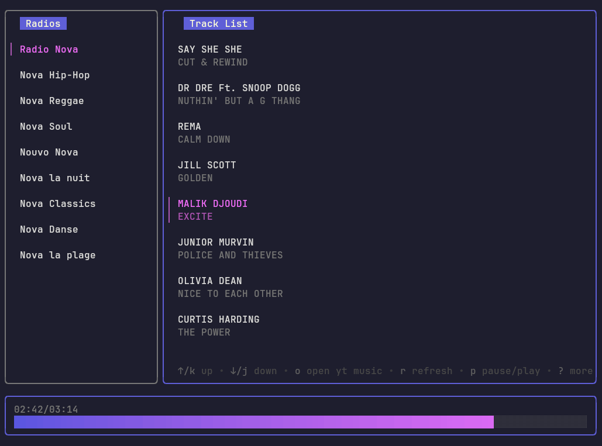

A terminal user interface to play song from radios using [mpv](https://mpv.io/) and [yt-dlp](https://github.com/yt-dlp/yt-dlp).



## Why ?

Music streaming services are bad at recommending me music but some radios do a great job at curating new songs. Unfortunately web player for these radios are often bad with a terrible ad/song ratio. 
This player retrieve the list of last played song and play it automatically.

When a song ends, the player retrieve the new list of last played song from the radio and play the next song automatically.

## Shortcuts

- `← →` Switch between panels 
- `↑ ↓` Navigate in the list
- `Enter` Select a radio or start a song
- `p` Play / Pause the current song
- `o` Open the song in YoutubeMusic
- `r` Refresh the track list

## Install

I don't have a prebuilt binary yet, you'll have to run the program from the source.

```
git clone https://github.com/Grafikart/lazyradio.git
cd lazyradio
go run .
```

## Feature Idea

- Add release to prebuild binary
- Add checks for dependencies
- Try to make it work for Windows (it should work in the WSL already)
- Use spotify to play song instead of mkv / yt-dlp
- Add a timer if we catch up with the live


